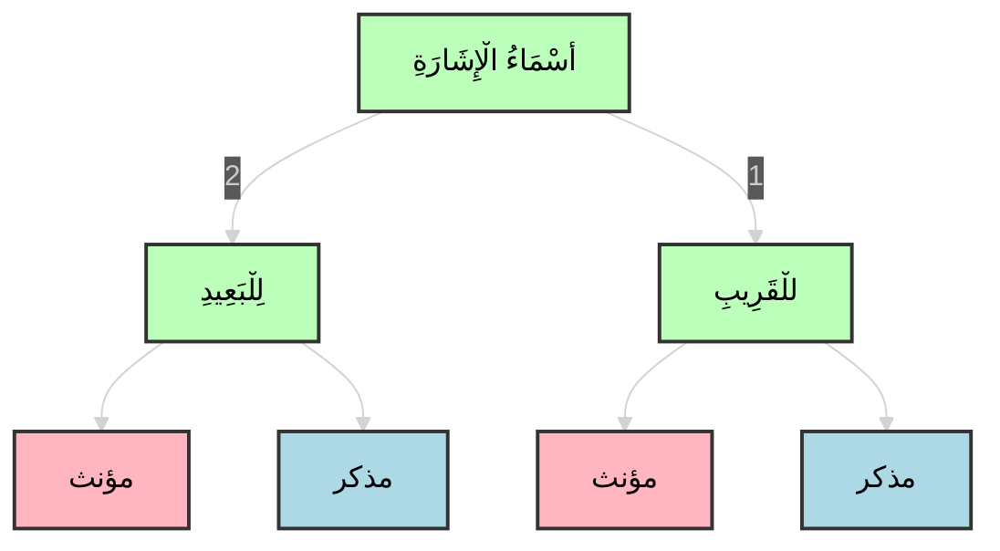

### أَسْمَاءُ الْإِشَارَةِ  

```mermaid
%%{init: {'theme': 'dark', 'themeVariables': {'darkMode': true}, "flowchart" : { "curve" : "basis", "nodeSpacing" : 50, "rankSpacing" : 50 } } }%%
flowchart TB
%% Nodes
    A["أَسْمَاءُ الْإِشَارَةِ"]
    B["للْقَرِيبِ"]
    C["لِلْبَعِيدِ"]
    B1["مذكر"]
    B2["مؤنث"]
    C1["مذكر"]
    C2["مؤنث"]
    

%% Paths
    A --2--> C
    A --1--> B
    B --> B2
    B --> B1
    C --> C2
    C --> C1


%% Styles
    classDef blueShade fill:#add8e6,stroke:#333,stroke-width:2px,color:#000
    classDef pinkShade fill:#ffb6c1,stroke:#333,stroke-width:2px,color:#000
    classDef greenShade fill:#bfb,stroke:#333,stroke-width:2px,color:#000
    class A,B,C greenShade;
    class B1,C1 blueShade;
    class B2,C2 pinkShade;
```

[Previous](../readme.md) | [Next](../ism-types/readme)