### Arabic Grammar:

#### Ism (اسم):
* Here is a diagram representing different types of Ism in Arabic grammar:

```mermaid
graph TD
    A["اسم (Ism)"] --> B["اسم علم (Proper Noun)"]
    A --> C["اسم مكان (Place Noun)"]
    A --> D["اسم زمان (Time Noun)"]
    A --> E["اسم مشترك (Common Noun)"]
    A --> F["اسم مفعول (Noun of Effect)"]
    A --> G["اسم فاعل (Noun of Doer)"]
    A --> H["اسم موصوف (Descriptive Noun)"]
    A --> I["اسم مفعول به (Direct Object Noun)"]
    A --> J["اسم اشارة (Demonstrative Noun)"]
    
    B --> K["محمد (Muhammad)"]
    B --> L["علي (Ali)"]
    C --> M["مدرسة (School)"]
    C --> N["مكتبة (Library)"]
    D --> O["صباح (Morning)"]
    D --> P["ليل (Night)"]
    E --> Q["كتاب (Book)"]
    E --> R["شجرة (Tree)"]
    F --> S["مفعول (Effect)"]
    G --> T["كاتب (Writer)"]
    H --> U["جميل (Beautiful)"]
    I --> V["طالب (Student)"]
    J --> W["هذا (This)"]
    J --> X["تلك (That)"]
    
    classDef greenShade fill:#bfb,stroke:#333,stroke-width:2px,color:#000
    class A,B,C,D,E,F,G,H,I,J,K,L,M,N,O,P,Q,R,S,T,U,V,W,X greenShade;
```

#### Small paragraph:
في اليوم من الايام، احمد ذهب الى الحديقة مع صديقه خالد، جلسا تحت شجرة كبيرة على العشب، بينما أطفال لعبوا في الملعب، حدثا خططهم المستقبل والأحلام كبيرة، ثم احمد رجع الى المكتبه بعد غروب الشمس، سعيدا بماقضا من الوقت جميل مع صديقه 

