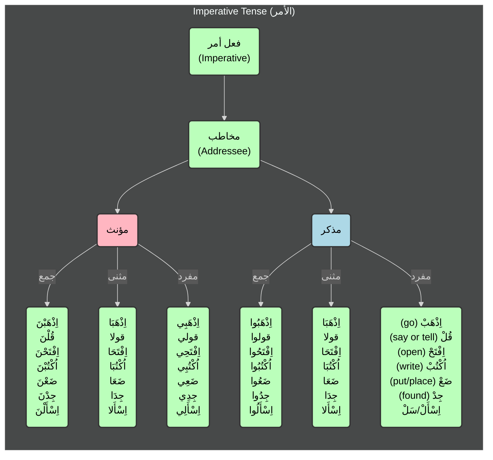

### Al Amr (الأمر):
The imperative mood in Arabic is called `الأمر` (Al Amr). It is used to give commands or orders. The imperative mood is formed by adding the appropriate prefix and suffix to the verb root.

#### Below is the flowchart for Imperative Mood (الأمر):

[Previous Topic](../al-madhi/readme.md) | [Next Topic](../examples.md) | [Examples](../examples.md)