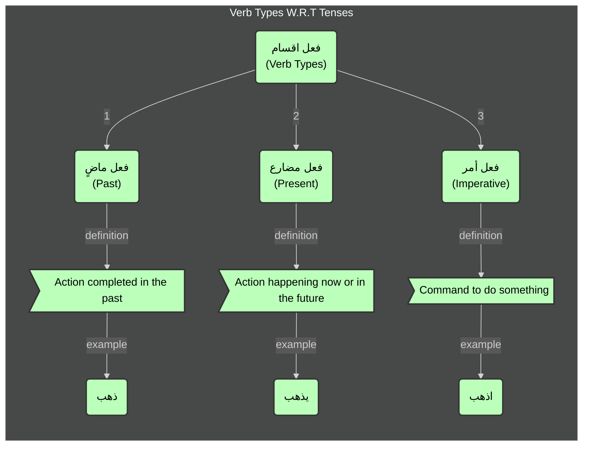

### Different Tenses:
- Present and Future Tense (`المضارع`)
- Past Tense (`الماضي`)
- Imperative Mood (`الأمر`)

#### Below is the flowchart for Verb Types W.R.T Tenses:

[Previous](../verb-types/readme.md) | [Next](../al-mudhari/readme.md) | [Examples](../examples.md)