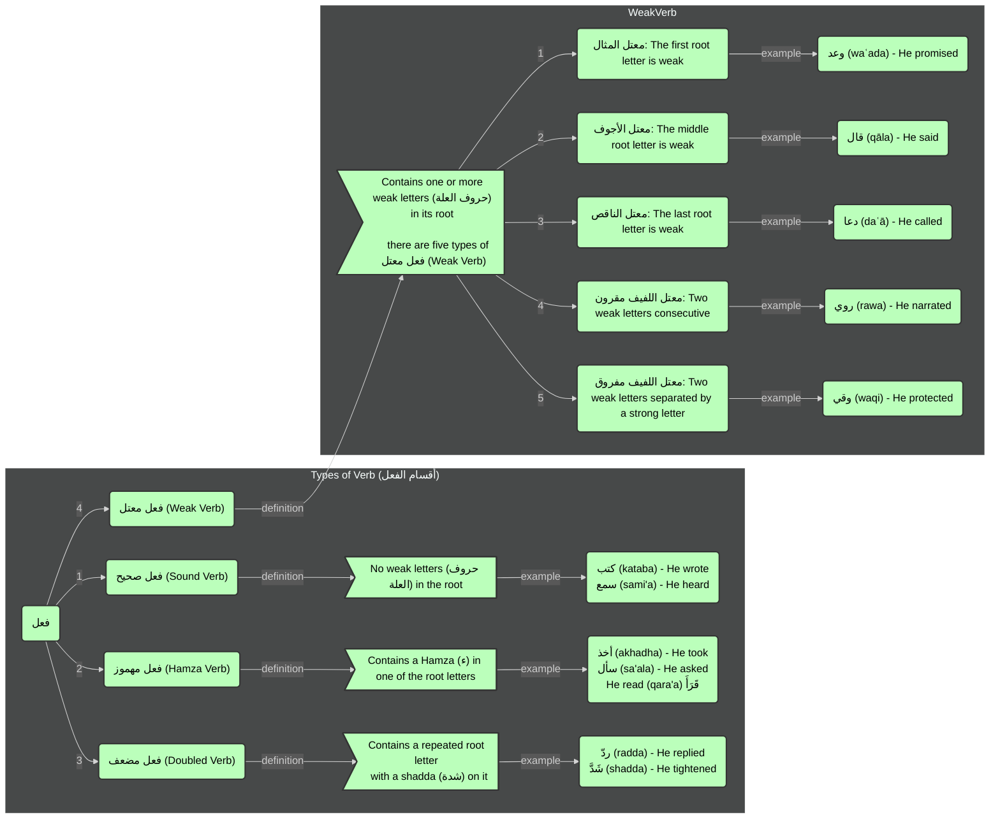

### Verb Types (`أقسام الفعل`):
There are four types of verbs in Arabic Grammar:
1. `فعل صحيح (Sound Verb)`
2. `فعل مهموز (Hamza Verb)`
3. `فعل مضعف (Doubled Verb)`
4. `فعل معتل (Weak Verb)`
   - There are five types of `فعل معتل (Weak Verb)`
   - `معتل المثال: The first root letter is weak`
   - `معتل الأجوف: The middle root letter is weak`
   - `معتل الناقص: The last root letter is weak`
   - `معتل اللفيف مقرون: Two weak letters consecutive`
   - `معتل اللفيف مفروق: Two weak letters separated by a strong letter`

#### Below is the flowchart for Types of Verb (`أقسام الفعل`):

[Previous](../readme.md) | [Next](../different-tenses/readme.md) | [Examples](../examples.md)